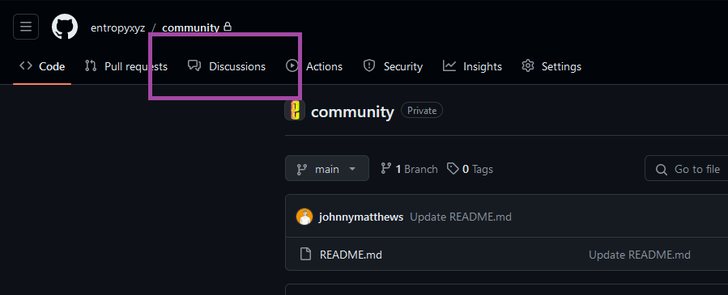
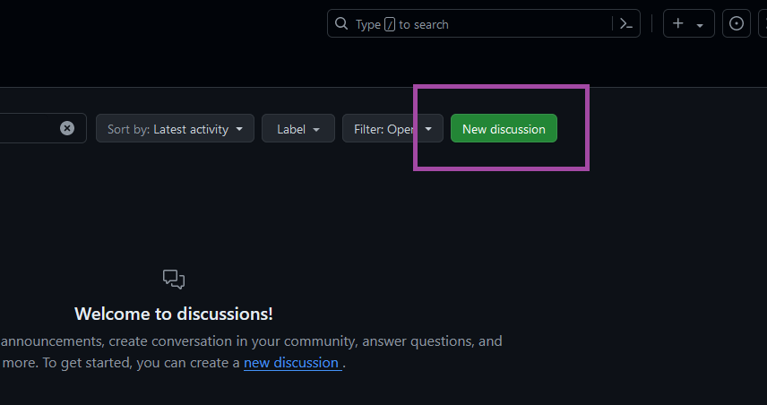
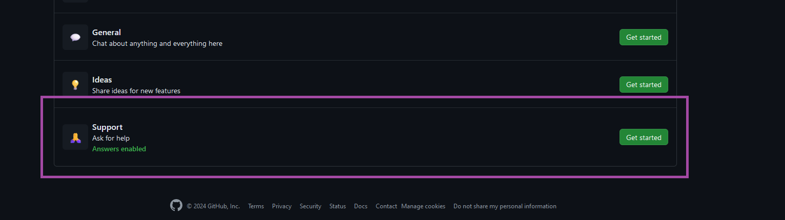

# Entropy Community

This repository houses community discussions, announcements, cool ideas for building on Entropy, and support tickets for the Entropy Network.

## Discussions

Want to chat about Entropy and interact with the rest of the community? Head over to the [**General** category under the **Discussions** tab](https://github.com/entropyxyz/community/discussions/categories/general)!

You can also join the [Entropy Discord server](https://discord.gg/H32pB3Ef).

## Annoucements

Keep an eye on the [**Announcements** category in the **Discussions** tab](https://github.com/entropyxyz/community/discussions/categories/announcements). The Entropy team will periodically post announcements and updates here. You can also find announcements on [Twitter account](x.com/entropydotxyz).

## Ideas

Have an interesting use-case for Entropy? Create a new post in the **Ideas** category in the [**Discussions** tab](https://github.com/entropyxyz/community/discussions/categories/ideas)!

## Support

If you're running into trouble, follow this process:

1. **Check the documentation**: there's a good chance that you can find the information you're looking for in the documentation.
2. **Check the [_Support_ category in the _Discussions_ tab](https://github.com/entropyxyz/community/discussions/categories/support): someone else may have solved the same problem you're having.
3. **Submit a support ticket**: follow the [steps below to submit a new support ticket](#submit-a-support-ticket) to the Entropy team.

### Submit a support ticket

To create a new support ticket:

1. Go to the **Discussions** tab.

    

1. Click **New discussion**.

    

1. Next to **Support** click **Get started**.

    

1. Enter a title and description for your issue. The more information you provide in your initial post, the faster we can help you.

Someone from the Entropy team will reply to your ticket and help you resolve your problem.
